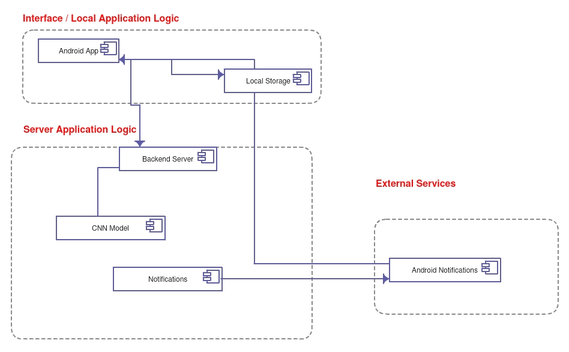
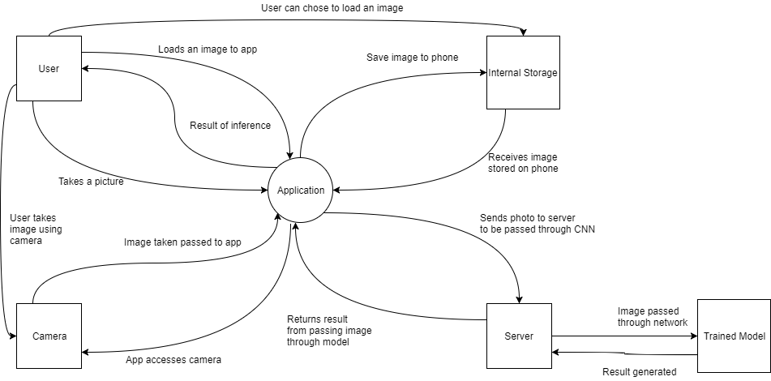
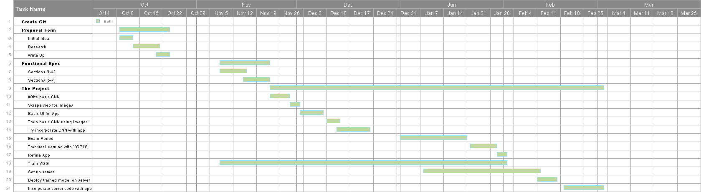
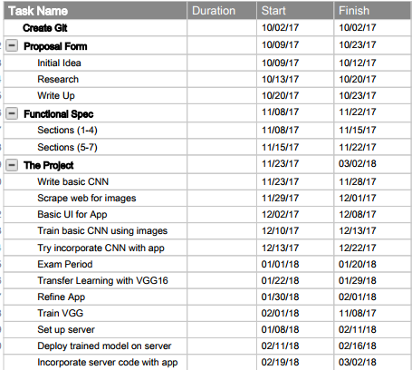

Skin Condition Classification System Using Deep Learning
3rd Year Project Functional Specification
Cathal Hughes: 15417922
Russell Brady: 15534623
Supervisor: Alan Smeaton

**1 Table of Contents**
[2        Introduction](#introduction)        
2.1        Overview of Project     
2.2        Project Scope        
2.3        Motivations        
2.4        Reference Links        
2.5        Glossary        
[3        General Description](#description)        
3.1        Product / System Functions        
3.2        User Characteristics and Objectives        
3.3        Use Cases        
3.4        Example Scenarios        
3.4.1        User wants to diagnose  a skin condition using phones camera.        
3.4.2        User wishes to diagnose skin condition using photo from gallery        
3.4.3        User wishes to send the picture along with the diagnosis to their doctor        
3.4.4        User tries to diagnose skin condition not trained in our CNN        
3.4.5        User takes a poor quality photo to be diagnosed        
3.4.6        A conclusive result is not drawn        
3.5        Constraints        
[4        System Requirements](#requirements)        
4.1        External Requirements        
4.1.1        Hardware        
4.1.2        Software        
4.1.3        Environment        
4.2        Product Functions        
4.2.1        The Application        
4.2.2        Skin Condition Classification        
4.2.3        Image Storing        
4.2.4        Email        
4.2.5        Notifications        
4.3        Usability Goals        
4.3.1        Scalability        
4.3.2        Performance        
4.3.3        Portability        
4.3.4        Setup        
4.3.5        Maintenance        
4.3.6        Security        
4.3.7        User Interface        
[5        System Architecture](#sys)        
5.1        Component Diagram        
[6        High-Level Design](#design)        
6.1        Design Overview        
6.2        Context Diagram        
[7        Preliminary Schedule](#prelim)    
7.1        Overview of Preliminary Schedule:        
7.1.1        Hardware Requirements        
7.1.2        Software Requirements        
7.1.3        GANTT Chart        
7.1.4        Task View Of Project       
[8        Appendices](#appendices)        
8.1        Possible Requirements Problems        
8.1.1        Requirement: The Application        
8.1.2        Requirement: Quick Inference        
8.1.3        Requirement: Skin disease classification        
8.1.4        Requirement: Classify image from gallery        
8.1.5        Requirement: Take picture of skin condition        
8.2        Challenges and Learning Requirement        
8.2.1        Learning about Convolutional Neural Networks and implementing VGG        
8.2.2        Optimization Techniques and Hyper-Parameters        
8.2.3        Collecting Data Sets of images        
8.2.4        Creating an Android Application        
8.2.5        Hosting our CNN on a server        
8.2.6        Uploading images to our CNN on a server and returning the result        
8.2.7        Security        

**2 Introduction** 

**2.1 Overview of Project**

This project is a proof of concept. We are simply demonstrating that such an application would be possible with more extensive time, research and training. We would like to stress that when we mention a user over the course of this project, we are referring to an experimental user and not a real world user. If the proof of concept works, then we would consider applying to the DCU research ethics committee for approval to start trials with real people and potentially real doctors.

This project is a skin condition classification system using an Android App. It will allow users to take a picture of a skin condition on their body or load an image from their gallery and will give an estimation as to the probability of it being a certain skin condition and supply a short description as to what the skin condition is. As well as this we will provide a disclaimer with the feedback telling users that this is an experimental system and the estimate is as a result of a small training set. The app will use the pre-trained Convolutional Neural Network, VGG16. This will be re-trained using our own datasets, this is known as Transfer Learning, and will yield us good accuracy and allow for easy expansion of the network. As VGG16 is a huge network we will need to deploy the trained model on a server and perform inference on the server and return the result to the app. This will require the mobile to have internet connection from either wifi or mobile data. In the event the mobile is unable to connect to the internet then the image will be left pending and if the user leaves the app and gets an internet connection the image will be uploaded to the server and the user will receive a notification.

The user will have the ability to save these images and thus see the progress of the condition over time. Also every image taken in the app will automatically attached to an email which will allow the user to send the images to a specialist or doctor.

The app will allow a user to predict what the condition might be, allowing the user to gain insight into the problem before visiting a doctor or perhaps cut out the need for the user to even visit a doctor. Inference should be instant and there should be no waiting times on the app. When the image is loaded from the gallery or an image is take using a camera, the result should be generated almost instantly.

The Convolutional Neural Networks will be written in Keras, a Python Machine Learning library, using a Tensorflow backend. Keras models can be easily deployed to servers. That means its&#39;s the ideal library to use for this project. We hope to use a Web Framework Flask which uses Python as the backend to host the CNNs.

The app will be used to estimate the probability of a certain skin condition in an image e.g. Psoriasis 80 %, Ringworm 10% . The system could be expanded in future to predict other skin ailments.

**2.2 Project Scope**

Our concept is as follows: This app is developed for any person who has or could develop a skin condition in their time. It is an estimation of what the user&#39;s condition could be and so it would help them decide whether they need to go to a doctor or specialist. Provided they are happy with the estimation and feedback, which will include links to appropriate websites for the ailments on which we trained the classifiers on, this could save the user time and money that would have to be spent consulting a doctor about a very treatable skin condition. Eczema and conditions of similar types are very common in babies and so this app is also targeted at young / new parents. Finally if the app was successful it could be potentially be used by doctors or dermatologists or in hospitals as it could provide a quick estimation to coincide with their opinion.

**2.3 Motivations **

Our main motivation for the developing the system was because both of us suffered some sort of skin condition last year and we didn&#39;t really have an idea as to what they were. In both our cases the breakouts of the conditions were not that bad and so we felt as students that money spent on a doctor was money wasted. From this we thought what if we would have been able to estimate  these conditions instantly ourselves and get a general idea as to what we were dealing with and then decide if we needed to get the skin condition treated. Nobody should ignore their general health and this app is being developed to try and prevent people from doing that.

Health is so important, and although a skin condition may not be as serious as other sicknesses, no one should be denying themselves the opportunity of having an idea as to what issue or problem they have. Parents with young kids will want to know all about their child&#39;s health and so this app will aid them if their child ever develops a skin condition and they do not know what it is.

The Smartphone is a constant in almost everyone&#39;s lives in this day and age. People use them for nutrition, time keeping, socializing, fitness, music, media/entertainment, etc. Why shouldn&#39;t they be used to look after your day-to-day health? The aim of this system is to provide a service which can estimate the likelihood of a skin condition instantly without having to pay for it.

**2.4 Reference Links**

App Development: https://developer.android.com/training/basics/firstapp/index.html

Learning Keras: https://keras.io/

Client/Server Refereneces: http://flask.pocoo.org/

**2.5 Glossary**

**Machine Learning** : &quot;Machine learning is an application of artificial intelligence (AI) that provides systems the ability to automatically learn and improve from experience without being explicitly programmed. Machine learning focuses on the development of computer programs ** ** that can access data and use it learn for themselves.&quot; - http://www.expertsystem.com/machine-learning-definition/

**Convolutional Neural Network** : &quot;Convolutional Neural Networks ( **ConvNets**  or  **CNNs** ) are a category of Neural Networks that have proven very effective in areas such as image recognition and classification. ConvNets have been successful in identifying faces, objects and traffic signs apart from powering vision in robots and self driving cars.&quot; - https://ujjwalkarn.me/2016/08/11/intuitive-explanation-convnets/

**Inference** : &quot;Inference is where capabilities learned during deep learning training are put to work. Inference cannot happen without training.&quot; -https://blogs.nvidia.com/blog/2016/08/22/difference-deep-learning-training-inference-ai/

**VGG16** : &quot;VGG16 (also called OxfordNet) is a convolutional neural network architecture named after the Visual Geometry Group from Oxford, who developed it. It was used to win the ILSVR (ImageNet) competition in 2014.&quot; - https://blog.keras.io/how-convolutional-neural-networks-see-the-world.html

**Keras:**&quot;Keras is a high-level neural networks API, written in Python and capable of running on top of TensorFlow, CNTK, or Theano.&quot; - https://keras.io/

**Tensorflow** : &quot;TensorFlow™ is an open source software library for numerical computation using data flow graphs.&quot; - https://www.tensorflow.org/

**Flask** : &quot;Flask is a micro web framework written in Python and based on the Werkzeug toolkit and Jinja2 template engine.&quot;

**3 General Description**

**3.1 Product / System Functions**

The main function of our product is an Android Application which will allow a user to upload / take a photo of their skin condition and then send the photo to a server where our trained CNN model is. Inference will be performed on the image by our trained model and an estimation of what the skin condition is will be returned to the app for the user to see.

The main features of the system will include:

- An Android Application
- A trained CNN which will be hosted on a server
- Skin condition classification
- Image Storing
- Ability to take picture using the app
- Ability to upload a picture using the app
- An email system

**3.2 User Characteristics and Objectives**

If this system were to be used by real-world users then the expected users would include the following:

- Regular people who may have some sort of skin condition and wish to get a quick estimation of the condition without having to consult a doctor.
- New and young parents who may wish to estimate the probability of a skin condition on their baby&#39;s skin.
- Doctors and nurses who may want to use the app to help in estimating skin conditions in patients.
- Non-medical people who may be doing volunteer work and wish to be able to treat patients.

**3.3 Use Cases**

|   USE CASE #1 | Classify skin condition using photo upload |
| --- | --- |
| Goal in Context | User can upload a photo of their skin condition from their camera roll which was taken previously and have the image classified |
| Scope &amp; Level | A user uploads a photo on the device to the app and inference is then performed on the photo using our trained CNN and an accurate prediction of the condition is returned   |
| Preconditions | The device must be connected to the internet |
| Success End Condition | The device should be still connected to the internet. A result should have been returned to the device. |
| Failed End Condition | No result is returned to the app but the user can re-upload photo for classification |
| Primary, Secondary Actors | The primary actor is the trained CNN which will be used to perform inference on the photo being passed through it.Other actors include the user who uploads the photo and the android app which needs to be able to upload a photo |
| Trigger | An upload button in the app |
| DESCRIPTION | Step,  Action |
|   | 1  User opens the app |
|   | 2  User chooses to upload a photo from gallery |
|   | 3   User picks photo from gallery to be classified |
|   | 4  Photo is sent to server where our trained CNN is |
|   | 5  The photo is then passed through the trained model |
|   | 6  Once inference is performed an estimation is attained and returned to the device to be displayed |
|    Priority: | This is one of the main functions of the system so its priority is very high |
| Performance | Altogether this use case should take about 10 seconds. Inference should only take 1 second. |

|   USE CASE #2 | Classify skin condition from photo taken |
| --- | --- |
| Goal in Context | User takes a photo of their skin condition from their camera roll and the image is then classified |
| Scope &amp; Level | A user takes a photo using an in-app camera option and inference is then performed on the photo using our trained CNN and an accurate prediction of the condition is returned   |
| Preconditions | The device should be connected to the internet |
| Success End Condition | The device should be still connected to the internet. A result should have been returned to the device. |
| Failed End Condition | No result is returned to the app but the user can re-take a photo for classification |
| Primary, Secondary Actors | The primary actor is the trained CNN which will be used to perform inference on the photo being passed through it.Other actors include the user who takes the photo and the android app which needs to be able to take a photo |
| Trigger | A button in the app which will access the devices camera |
| DESCRIPTION | Step,  Action |
|   | 1  User opens the app |
|   | 2  User chooses to take a photo |
|   | 3   User takes photo of their skin condition |
|   | 4  The photo is passed to the server where the CNN is |
|   | 5  The photo is then passed through the trained model |
|   | 6  Once inference is performed an estimation is attained and returned to the device to be displayed |
|    Priority: | This is one of the main functions of the system so its priority is very high |
| Performance | Altogether this use case should take about 10 seconds. Inference should only take 1 second. |

|   USE CASE #3 | Send the photo of skin condition to doctor |
| --- | --- |
| Goal in Context | User can send the photo of their skin condition to their doctor with its diagnosis to get their advice on treatment |
| Scope &amp; Level | Once the condition is diagnosed then you can then send the image and diagnosis to your local GP   |
| Preconditions | The device needs to be connected to the internet |
| Success End Condition | The email is sent successfully to the doctor |
| Failed End Condition | The user will be notified that the email failed to send and to re-send again |
| Primary, | The primary actor is the user who is using the app and wants to send the email to their doctor |
| Trigger | A button which will be displayed after the image is classified |
| DESCRIPTION | Step | Action |
|   | 1  User uploads / takes photo and has it classified |
|   | 2  User chooses to &#39;send to doctor&#39; after the image is classified |
|   | 3   User inputs a message for the doctor |
|   | 4  User sends email to doctor |
|    Priority: | This is one of the main functions of the system so its priority is very high |
| Performance | Altogether this use case should take about 10 seconds. Inference should only take 1 second. |
**3.4 Example Scenarios**
3.4.1 User wants to estimate the probability of  a skin condition using phones camera.

In this scenario, a person has just begun to notice an outbreak of some sort of some kind of skin ailment on their body. They access our app and take a picture of the condition. Once they take the picture, it is then sent to the server where it is run through our trained model and a estimation is returned. The user sees the probability of a certain skin condition on the app.
3.4.2 User wishes to estimate the probability of a skin condition using photo from gallery

In this scenario, a person has taken a picture of a skin ailment on their body. They access our app and upload a picture of the condition. Once the picture is uploaded it is then sent to the server where it is run through our trained model and an estimation is returned. The user sees the probability of a certain skin condition on the app.
3.4.3 User wishes to send the picture along with the diagnosis to their doctor

Once a user has been returned an estimation they then have the choice to send the estimation and the photo to their doctor through the app.
3.4.4 User tries to classify skin condition not trained in our CNN

If the uploaded image is not an condition trained on our network, it should return a low percentage for each skin condition meaning that it is more than likely not any of the conditions in our network.
3.4.5 User takes a poor quality photo to be classified

If a user chooses to take a photo of their skin condition and have it classified, but they decide before sending the photo, that it is not of good enough quality, they will have the option to delete the photo and retake another photo to be sent to the CNN for classification.
3.4.6 A conclusive result is not drawn

A user will upload a photo from gallery or take a photo from their phone and upload the photo for inference to be performed on it and have a result returned. If the result is not conclusive then you will be told that the skin disease may not be recognized by the CNN or that the photo may be of poor quality. The user will be offered the option to retake the photo in the case that the previous photo may have been inconclusive due to poor picture quality.

**3.5 Constraints**

One of our main constraints is the size of our trained CNN. Already it looks like the trained models are going to be over half a gigabyte if we were to place this on the app. Obviously it is not feasible to have an app which is over half a gigabyte so we have decided to host the trained models on a server and send the photo to the server for inference to be performed there. This solution itself offers its own constraints. Using a server to host our trained CNN means that we are reliant on the internet to allow us to classify a photo. Using the app with no internet access could be a problem as inference can&#39;t be performed unless the photo can reach the server.

Also we are limited by the quality of photo a phone can take. We would preferably be hoping only high quality images will be taken using a high spec phone as this would give the CNNs the best chance of the most accurate result.

Another constraint is that we can only estimate for pictures that the CNNs have been trained on. If a user has a rare skin condition or a condition that is not very distinguishable then the CNNs will not be able to give an accurate result.

**4 System Requirements**

**4.1 External Requirements**

4.1.1  Hardware

For the user to use this app all they need is a phone running Android OS with a relatively standard camera.

4.1.2 Software

The app would preferably run on the Android OS 6.0(+) Marshmallow.

4.1.3 Environment

For the system to be used to its full potential then it need to have an internet connection in order to make to upload images to a server and receive requests.

Mobile Data or a WIFI connection would be perfect.

Ideally an SD Card in the phone would work well as we would be able to store the images and see them change over time.

**4.2 Product Functions**

4.2.1 The Application

The system will provide the application downloadable from the Google play store, which will contain a main page that allows the user to tap a button to transfer them to the skin ailment classification page. The user&#39;s phone camera will activate upon entering this page. From here the user would have the options to take a photo of a skin condition, or load a condition from the gallery to classify. The application would also be connected to the user&#39;s email account which would allow them to send their classified images to a specialist or doctor.

4.2.2 Skin Condition Classification

This system is built around the concept of being able to classify different skin conditions. In order to achieve this, a photograph will have to be taken of the skin condition and passed through a pre-trained Convolutional Neural Networks hosted on a server. This image will automatically attached to an email ready to be sent and will also be stored to the phones internal or external memory allowing the user to compare the change in the condition over time. If the image condition is recognisable to the CNNs, it will return a result instantly.

4.2.3 Image Storing

The images taken would be stored on the phone allowing them to be viewed again so that the user can see a change in the skin condition over time. This allows the user to see if the condition is healing or getting worse.

4.2.4 Email

The application will allow you to send an email to a doctor or specialist or to whoever they like. Upon taking the image, the image is automatically attached to an email. In the main menu there is an email button. Upon pressing this button the email app is opened with the attached images and their diagnosis.

4.2.5 Notifications

If the app is unable to upload the image as it has no internet connection, it will send a notification once the app has connection and will inform the user of the result.

**4.3 Usability Goals**

4.3.1 Scalability

As we are using VGG16 this allows for huge expansion of the network. As VGG16 was used to classify 1000 + categories, it will have no issue classifying ten plus different datasets when retrained. Also the uses for VGG16 are endless, it could be used to classify moles or bug bites or anything once given the appropriate datasets. In the future we could expand the network to classify bug bites or moles or even different skin conditions. CNNs can always have their accuracy increased so we will look into making the CNN as accurate as possible.

4.3.2 Performance

As this system relies heavily on the user&#39;s internet connection, this will likely be the first limiting factor in terms of the performance of this system. Another factor could be the speed of inference on the server. If the server had GPU capabilities ten that could speed up inference. Naturally if the server is being bombarded by request then the system will slow too.

However, assuming an adequate internet connection, and with the restriction on the number of requests, the performance of this system should be suitable.

4.3.3 Portability

The app can be used in any situation where it has an internet connection. It could be used domestically, professionally or in a hospital provided it has internet connection.

4.3.4 Setup

There is no set up involved with this app. Once downloaded it is ready to use.

4.3.5 Maintenance

This system will require almost no maintenance from the user, other than managing the images on their phone. Maintenance of the CNN on the server will be done by the team and hopefully the only time we need to change something is to add improved functionality or accuracy to the network

4.3.6 Security

The primary security concerns is what happens to the user&#39;s images after they have been uploaded to the server. The images are not stored on the server, simply passed through the CNN and the result returned. The image is only stored on the user&#39;s phone. Perhaps we could add functionality in that the user has an account and all photos related to the user are attached to their account. Image vetting will be performed on the images on the server to make sure they are not anything but an image and that the images do not contain any illegal content.

4.3.7 User Interface

The UI for this system should be sleek and self-explanatory while still providing the user with all the functionality needed. It is important that the application is not intimidating to use and is accessible for all users. Usability is key as to not deter anyone from using the app. Although it is health related, no terms on the app should be too complex so that no person can&#39;t use it.

**5 System Architecture**

**5.1 Component Diagram**

**6 High-Level Design**

**6.1 Design Overview**

Here we provide a Context Diagram illustrating how our system will be connected and what data will be transferred between each component. This diagram is ideal as it shows the different components and how they are linked. This diagram shows what info needs to be passed between components and gives a very high level view of our project.

This diagram shows how the Application interacts with the user, the server, the camera and internal storage of the phone. The application will take input from the user, store or load images from the internal storage, access the camera to take picture, upload images to the server and receive to the result. The relationships between external entities include user and internal storage, for loading an image, user and camera, so the user can take a picture and the server and the Trained Model as the server will pass the uploaded image through the trained model and return the result.

**6.2 Context Diagram**

**7 Preliminary Schedule**
**7.1 Overview of Preliminary Schedule**

The schedule below was designed using smartsheet.com and shows what we have initially suspected to be the main tasks of this project. These start and end dates subject to change. The tasks could change either as the project progresses but at least it gives us a guideline to follow.

Below, a GANTT chart can be seen which shows this same information in a more visual fashion. The timeline for these tasks are represented by a green bar.

7.1.1 Hardware Requirements

- Android Phone
- Phone that has a camera
- Internal storage available on the phone
- Server
- GPU potentially depending on the training time required.

7.1.2 Software Requirements

- Java &amp; Android App Development Software
- Python
- Server side code

7.1.3 GANTT Chart

7.1.4 Task View Of Project

**8 Appendices**
**8.1 Possible Requirements Problems**
8.1.1 Requirement: The Application

Possible Problem: Integrating Server side code with the trained CNN with the app.
Proposed Solution: Store a more light weight CNN on the app itself.

Possible Problem: Getting responses from the server to the app.
Proposed Solution: Using POST and GET requests will make this possible along with a decent connection to the internet.

Possible Problem: Making interaction with the server fast.
Possible Solution: Have all models pre-loaded on the server so that only inference needs to be performed, and that the phone does not need to wait for a model to initialize.

8.1.2 Requirement: Quick Inference

Possible Problem: Inference for a huge network may not be instantaneous.
Proposed Solution: In order to fix the above problem, we could deploy the CNN on a server with access to a GPU. Otherwise we could deploy a few different lighter weight CNNs on the server.

8.1.3 Requirement: Skin disease classification

Possible Problem: The system may struggle to classify between two conditions that are very similar.
Proposed Solution: Scrape the web for more training data and re-train the network. Also research best optimizers and techniques for improving CNN accuracy. Also, a similar solution to the one above, we could create a new CNN to classify each new disease.

8.1.4 Requirement: Classify image from gallery

Possible Problem: Image may not be a skin condition that our CNN has been trained on.
Proposed Solution: Return a percentage result of all the conditions it could be.

8.1.5 Requirement: Take picture of skin condition

Possible Problem: Quality of picture may not be good enough.
Proposed Solution: If no result relating to a skin condition is returned advise the user to re-upload a better image or find a similar image online and upload from the user&#39;s phone gallery.

**8.2 Challenges and Learning Requirements**
8.2.1 Learning about Convolutional Neural Networks and implementing VGG

Neither of us have ever worked with Convolutional Networks before and we expect that first trying to understand them and how they work is going to present us with our first main challenge. We are currently familiarizing ourselves with CNN&#39;s and have spent a lot of time researching them. In order to be able to get a CNN working on our own datasets of images we will have to first have a deep understanding of how they work.

Training VGG16 to be able to classify different skin conditions is going to prove very difficult and will provide a huge learning experience. We previously have no experience in Machine Learning but have a great interest in the area. We will need to figure out how best to train the network in order to maintain a high degree of accuracy when classifying images.

8.2.2 Optimization Techniques and Hyper-Parameters

Finding the best optimizers for the CNNs will be a task in itself as there are a multitude of them including Stochastic Gradient Descent, RMSProp, Adadelta etc. Also there parameters like what sort of activations to use on each layer, these include, Sigmoid Activation Function, Softmax and Relu. All these have different effects and finding the best combination of these parameters and optimizers will take some research.

8.2.3 Collecting Data Sets of images

In order to train the CNN to differentiate between different skin conditions we are going to have to have to collect datasets of each skin condition. Finding suitable sets of images and an acceptable quantity of each condition will be a challenge in itself and we are exploring different ways of obtaining such datasets. For noisy images we will have to take screenshots of the affected area as we only want to see the condition nothing else.

8.2.4 Creating an Android Application

For our project, we must build an android application, which again is something that neither team member has prior experience in. The basic design and construction of the application should be relatively straightforward. However, the main challenges will likely be connecting the app to the CNN which will be hosted on a server.

Designing the application is an opportunity to expand our skills in UI design and usability. As multiple modules have been focused on this topic over the course of the past three years, this is a valuable opportunity to implement what has been learned in a real-world scenario. We hope to create an interactive GUI which will be appealing to users.

8.2.5 Hosting our CNN on a server

Due to the expected size of the CNN it became clear to us very quickly that we weren&#39;t going to be able to have the trained model on the android app. Therefore we are going to have to host the trained model on a server. Neither of us have ever worked with servers and look forward to the opportunity. Figuring out how the app is going to interact with the trained model on the server is going to be a challenge.
8.2.6 Uploading images to our CNN on a server and returning the result

As mentioned neither of us have worked with server side code and so we will have to learn all about POST and GET requests. Also image encoding and JSON objects are all things we will have to learn in order to upload the image from the app to the server.

8.2.7 Security

These images cannot be stored on the server or re used by anyone without explicit permission from the user, the user should only have access to them on their phone. Also the server shouldn&#39;t be open to some sort of attack and so the files uploaded should be of a certain type e.g. PNG or JPEG. Also we should moderate what is uploaded to the server, no nudity and images of minors or faces etc. These are challenges we will have to overcome.

