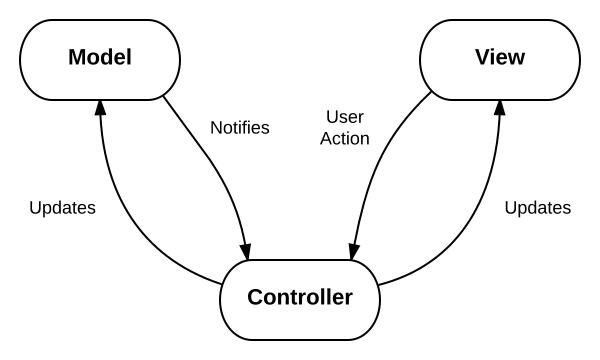
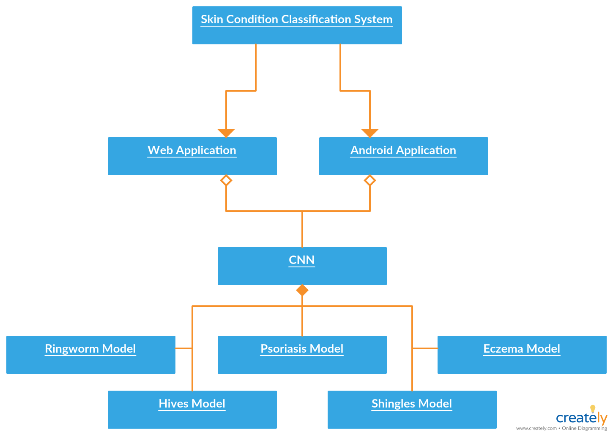

**Skin Condition Classification System Using Deep Learning**  
===================================================
3rd Year Project Technical Specification  
Cathal Hughes: 15417922  
Russell Brady: 15534623  
Supervisor: Alan Smeaton  

**Table of Contents**  
====================
+ [1        Introduction](#introduction)  
    - [1.1        Overview of Project](#overview)     
    - [1.2        Glossary](#glossary)        
+ [2        System Architecture](#description)     
    - [2.1        Convolutional Neural Network](#cnn)
    - [2.2        Web Application](#webapp)
    - [2.3        Android Application](#androidapp)
+ [3        High Level Design](#design)        
	- [3.1 		  Design Pattern Used](#dp)
    - [3.2        Component Diagram](#component)   
    - [3.3        Object Diagram](#object)   
    - [3.4        Data Flow Diagram](#data)   
+ [4        Problems And Resolutions](#pas)     
    - [4.1        Gathering Datasets of Images](#problem1)
    - [4.2        Size Of CNN](#problem2)   
    - [4.3        Accessing CNN on server from Android App](#problem3)   
    - [4.4        Send photo to server from Android App when no Internet connection](#problem4)
    - [4.5        Returning the results to the Android App](#problem5)   
    - [4.6        Testing the accuracy of our CNN and datasets](#problem6)   
    - [4.7        Dealing with CPU and time cost of K-Fold Cross Validation on laptop](#problem7)
    - [4.8        Images uploaded being stored on server](#problem8)
    - [4.9        Increasing the speed of inference and returning a result quickly](#problem9)
    - [4.10		  CNN Accuracy stuck on 0.5](#problem10)
+ [5        Installation Guide](#guide)        
    - [5.1        Accessing the Web App](#install1)
    - [5.2        Accessing the Android App](#install2)

**1 - Introduction**   
==========================================
**1.1 - Overview of Project**
This project is a proof of concept. We are simply demonstrating that such an application would be possible with more extensive time, research and training. We would like to stress that when we mention a user over the course of this project, we are referring to an experimental user and not a real world user.
This project is a skin condition classification system implemented through an Android App and a Web app. On the Android app and web app users will be allowed to take a picture of a skin condition on their body or load an image from their gallery for classification. When classification has been done the network will return an estimation as to the probabilities of it being one of a set of possible skin conditions it is trained on. We will provide a visual representation of the data through a bar chart as well as displaying the photo which was taken. 
The app will use the pre-trained Convolutional Neural Network, VGG16. This will be re-trained using our own datasets, this is known as Transfer Learning, and will yield us good accuracy and allow for easy expansion of the network. As VGG16 is a huge network we will need to deploy the trained model on a server and perform inference on the server and return the result to the app. This will require internet connection to be available from either Wi-Fi or mobile data. The user will have the ability to send an email to an address they input containing the image as well as the results from the app. 
The app will allow a user to estimate as to what the condition might be, allowing the user to gain insight into the problem before visiting a doctor or perhaps cut out the need for the user to even visit a doctor. Inference should be instant and there should be no waiting times on the app. When the image is loaded from the gallery or an image is take using a camera, the result should be generated almost instantly.
The Convolutional Neural Networks will be written in Keras, a Python Machine Learning library, using a Tensorflow backend. Keras models can be easily deployed to servers. That means its's the ideal library to use for this project. We hope to use a Web Framework Flask which uses Python as the backend to host the CNNs.
The app will be used to estimate the probability of a certain skin condition in an image e.g. Psoriasis 80 %, Ringworm 10% . The system could be expanded in future to predict other skin ailments.

**1.2 - Glossary**
**Machine Learning:** &quot;Machine learning is an application of artificial intelligence (AI) that provides systems the ability to automatically learn and improve from experience without being explicitly programmed. Machine learning focuses on the development of computer programs ** ** that can access data and use it learn for themselves.&quot; - http://www.expertsystem.com/machine-learning-definition/

**Convolutional Neural Network:** &quot;Convolutional Neural Networks ( **ConvNets**  or  **CNNs** ) are a category of Neural Networks that have proven very effective in areas such as image recognition and classification. ConvNets have been successful in identifying faces, objects and traffic signs apart from powering vision in robots and self driving cars.&quot; - https://ujjwalkarn.me/2016/08/11/intuitive-explanation-convnets/

**Inference:** &quot;Inference is where capabilities learned during deep learning training are put to work. Inference cannot happen without training.&quot; -https://blogs.nvidia.com/blog/2016/08/22/difference-deep-learning-training-inference-ai/

**VGG16:** &quot;VGG16 (also called OxfordNet) is a convolutional neural network architecture named after the Visual Geometry Group from Oxford, who developed it. It was used to win the ILSVR (ImageNet) competition in 2014.&quot; - https://blog.keras.io/how-convolutional-neural-networks-see-the-world.html

**Keras:**&quot;Keras is a high-level neural networks API, written in Python and capable of running on top of TensorFlow, CNTK, or Theano.&quot; - https://keras.io/

**Tensorflow:** &quot;TensorFlow™ is an open source software library for numerical computation using data flow graphs.&quot; - https://www.tensorflow.org/

**Flask:** &quot;Flask is a micro web framework written in Python and based on the Werkzeug toolkit and Jinja2 template engine.&quot;

**2 - System Architecture**
==============================================

**2.1 - Convolutional Neural Network**   
Both the Android App and Web App will use a set of Convolutional Neural Networks in order to classify a skin condition. The app will use networks based on the pre-trained Convolutional Neural Network, VGG16. The CNNs will be written in Keras, a Python Machine Learning library, using a Tensorflow backend. This network is retrained on our own datasets, known as transfer learning, and it yields good accuracy and allows for easy expansion. Our overall network will consist of five single-class classifiers (for each of our conditions; Hives, Eczema, Psoriasis, Ringworm and Shingles) and will identify the percentage chance of it being that skin condition before moving onto the next classifier. Once the image has been run down through all the classifiers a result will be returned detailing what the skin condition is most likely to be. For each classifier we tried to  gathered 1200 images of the specific skin condition - This would allow for a dataset of 1000 training images and 200 validation images. As well as this, because we are using the concept of a single class classifier, we also needed a training and validation data set of random images in order to train the network.  The network will be deployed on a server using the python web framework Flask to host the CNNs. Keras models can be easily deployed to servers meaing it is the ideal library to use for this project. 

**2.2 - Web Application**
Our web app is developed using the Python web framework Flask. Flask manages our backend and allows us to use jinga html templates as well as giving us direct access to our CNNs which are stored in the same web framework. The homepage of our web app gives users the option to choose an image from their folders to upload for classification, or depending on the device, may allow users to take a photo for classification. Mobile devices and iPads for example allow the user to take photos using the web app but laptops and desktops don’t. The web app sends the image which has been uploaded to the CNN on the same server. Once inference is performed, the homepage is rendered again with the results of inference, a graphical barchart representation of the results as well as the image itself and the option to send the results in an email. We use Flask’s inbuilt mail library to send an email with the relevant details in it. 

**2.3 - Android Application**
Our Android App was developed using Android Studio and allows users to upload an image / take a photo for classification. The user then chooses to classify the image. The image is encrypted and sent to the server where the CNN is using a POST request. It is decrypted and passed down through our trained models where inference is performed. Once this is done, a result is returned to the android app where it is rendered. A link is also provided to a graphical barchart representation of the results for the user to view. Icons used on the android app were downloaded from flaticon.com

**3 - High Level Design**
=========================================
**3.1 - Design Pattern Used** 
We followed the same design pattern for both the web app and the android application. This was made simple by the fact both of them use the same backend and same functions to generate results.
The design pattern we tried to follow was **Model-View-Controller**. It is a architectural pattern for implementing user interfaces. It divides an application into three parts: the Model, the View and the Controller. This is done to separate internal representations of information from the ways information is presented to and accepted from the user. The MVC design pattern decouples these major components allowing for efficient code reuse and parallel development. (Wikipedia)
The fact that it allows for code reuse made it the perfect design pattern for our project as it helped us design a backend that could be interacted with by a web app and an android app.

   

•	The model stores and manipulates data that is retrieved according to commands from the controller.
•	The view generates output for the user based on changes in the model.
•	The controller acts on both model and view; it sends commands to the model to allow it to manipulate data and to the view to change information presented to users.

**MVC in the web app**

**Model**

The model for the web app can be located in the loadModel.py file in the model folder. This file loads all the Convolutional Neural Networks for the project. These Convolutional Neural Networks classify Psoriasis, Ringworm, Hives, Shingles and Eczema. These models are used to classify images uploaded by the user.

**Controller**

This can be split up into three sections and is located in the app.py. The controller initialises, performs routing and execution.  In app.py, our controller, we initialise our convolutional neural networks provided by our model. Also we initialise our email service.
The controller then provides routes for all aspects of the web app. Some examples routes are “/predict” and “/predictClient”. These routes are made up of controller actions. Inside these controller actions, two main things occur: the models generate the predictions for images, and this data is then passed to a view, which renders the requested page. The data generated by the models (CNNs) is generally stored in a data structure and then sent to a view.
Execution just ensures that app.py can be run as a script.

**View**

The view is what the user sees, the UI of our web app which displays data from the model. These views are stored in the templates folder and we used Jinja2 templates to generate HTML pages. We also used Bootstrap in these HTML pages to aid us in our design and make for a more stylish UI.

   

**MVC in the Android App**

**Model**

Much the same as the web app, the Android application uses the same model. This is the five Convolutional Neural Networks which are stored on the server and handled by the loadModel.py file. When the user inputs values on the android app (uploads an image), the view will send this to the controller client side and then to the controller server side.

**Controller**

As mentioned we have a controller both client side and server side for the Android Application. The controller client side is located in the UploadImageToFlaskServer.java file. This user input from the view and consequently using controller actions sends the image to the server side controller via a POST request. When it reaches the server side controller the request is sent to the “/predict” route which using controller actions gets the predictions for the image from the model. The predictions from the model are sent back to the controller, which sends the results back to the application and the correct view is updated accordingly with the information generated by the model.

**View**

On the android application these are the classes that the user interacts with. It is the UI of the app. These are located in the *Activity.java files. The user can interact with these views and the user’s input (uploading a photo/taking a photo) are sent to the controller to be sent to the model.

   

**Conclusion**

Overall it is clear why the MVC design pattern suited both aspects of our project. It allowed us to us the same backend for the app and web app and made managing the code far easier. It provided a much needed structure to a project that could have easily got out of hand due to the fact that we had both an android app and a web app. As MVC decouples the various components of a project, it allowed us to work in parallel on different components without any errors. It allowed us to develop the android app and web app at the same time as we knew they would use the same model and controller.

**3.2 - Component Diagram**   
   
The Component Diagram outlines how the system’s various components interact with other components in order to achieve the system’s various tasks. It shows the various parts that make up the system as a whole. In the Diagram we can see that the Web App and the Android App both access the back-end server in order to carry out the main system tasks. The back-end server manages the CNN, Email System and the results being returned back to the Android and Web App. Both Apps require local storage to temporarily keep a record of the users image, the prediction being returned and the bar chart representation of the prediction. 

**3.3 - Object Diagram**    
   
This object diagram focuses on the objects which make up the system at the highest level and focuses on the links between these objects. It can be seen the application is made up of a Web App and an Android App which interact with a backend server consisting of our pre-trained Convolutional Neural Network which has been trained on 5 different skin conditions.

**3.4 - Data Flow Diagram**   
   
This data flow diagram illustrates how data is processed by a system in terms of inputs and outputs. Its focus is on the flow of information, where data comes from, where it goes and how it gets stored. The image which is taken using the web app / android app is the main data which flows through the system in order for inference to be performed and once this is done a prediction is returned. 

**4 - Problems and Solutions**
==========================================

**4.1 - Gathering Datasets of Images**   
One issue we faced right from the minute we decided on this project was how we were going to gather images for the relevant skin conditions. In order to train our CNN we needed a set of training and validation images. We looked up various Dermatology websites which had datasets of images of the skin conditions we wanted to train the network on, however these images had watermarks on them rendering them useless for use.    
**Solution:** We contacted the various websites to see if we could use their images and had no success so we resorted to scraping our own images off the internet using a chrome extension. We then had to sieve through these images to get rid of any irrelevant images. We were struggling in relation to the number of images we could get our hands on, so we decided to augment all photos in various ways to create more images.  

**4.2 - Size Of CNN**   
It became apparent as soon as we started to train our networks that each classifier was going to be of a substantial size (nearly a gigabyte). When you multiply this 5 times it soon becomes clear having the CNN stored locally on the Android App was not going to be a viable option.    
**Solution:** We decided that we would host the CNN on a server and make POST and GET requests from the Android App. This would involve sending an image to the server, have inference performed on it, and return the result back to the phone.    

**4.3 - Accessing CNN on server from Android App**  
We needed to make POST and GET request from the android app. POST and GET requests were not anything we handles before, let alone on an android app.
**Solution:**  This was one of the trickier problems to try solve. For starters finding the appropriate Android Library to use was difficult. When we got the most suitable library and started making POST requests to the Flask back-end, issues arose immediately as we couldn't access the request. We then returned to the android code and when encoding the image we put it in a JSON object before sending it. We then could handle the request on the back-end as a result. 

**4.4 - Send photo to server from Android App when no Internet connection**   
Sending an image to the server from the device when there is no internet connection was proving a problem. If there was no internet the upload simply failed which is not ideal.   
**Solution:**  We decided to implement a broadcast listener which would recognise if there is no connection available to the server and wait until it finds a connection before sending the image for upload.

**4.5 - Returning the results to the Android App**  
Returning a string from the back-end to the app was not an issue but to return images and a visualisation data was becoming an issue. We wanted the app to have all the features of the web app, in that people would be able to email their results to themselves or to a professional and also see a visualisation of their results.  
**Solution:** To allow the android users to have all these services we made the most of the web app and made a web page specific to the android app. When the user clicks "Visualisation Of Results" the mobiles browser is opened to a mobile friendly web page where they can see a table of their results potentially containing links,  a bar chart of their results and the email service that the web app has.   

**4.6 - Testing the accuracy and generality of our CNN**   
When we had gathered all the images we needed to carry out the training of our network and had done initial test training we soon realised that the network was over fitting on the data. We needed a way to stop the network from over fitting on the data, but also to make sure that the accuracy and generality of our network was independent of the images in our train and validation folders.   
**Solution:**  Our solution was to implement K-Fold cross validation with early stopping. For each skin condition K-Fold cross validation involved training that network numerous times, each time changing the images in the train and validation folders. The idea was that no matter what images were in the train or validation folders, the accuracy of the network should be the same. This was the best was of testing out network to make sure its accuracy wasn't dependant on the images which were in the train and validation folders. Each network was trained with early stopping to increase the generality of the network. This kept track of whether the accuracy had changed over the previous 4 iterations and if it hadn't then it was time to stop.   

**4.7 - Dealing with CPU and time cost of K-Fold Cross Validation on laptop**   
In solving the problem of how we were going to test our network we created an even bigger problem in the process, how we were going to get the time and CPU power to train five classification networks six times (30 trained networks!). Our laptops weren't going to be able to cope with all of that stress on the CPU, especially when we were trying to finish the web app and Android App at the same time.   
**Solution:** We decided that we would create several instances on our Amazon Web Server accounts and set up a script which would run the networks of one condition in a for loop. This way we could run them away on the server and then collect all the results when it was finished running. In the meantime we could carry on with our other work on the project.     

**4.8 - Images uploaded being stored on the server**    
In order for us to be able to send the image to the server for inference to be performed we needed to temporarily store the image. Obviously you don't want to be keeping record of these images, however we were ending up with multiple images in our image folder as they weren't being cleared over time.    
**Solution:** In order to counteract this we implemented a function which cleared all images in the folder once the results has been returned to either the web app or the android app. In this case, the images would never be stored longer than was necessary. This is a security feature in itself as it would be negligent to leave images on the server.

**4.9 - Increasing the speed of inference and returning a result quickly**     
Once we managed to get our Web App and Android App interacting with the server we then wanted to see how we could improve the time taken between the user pressing classify image and a result being returned. This basically depends on how long it takes for the image to reach the server, then for inference to be performed, and for a result to be return to the app. Initially it was taking a couple of seconds for the result to be returned and we weren't fully happy with this.   
**Solution:** We decided to decrease the size of the image being uploaded to the server. In turn this increased the speed at which the image reached the server as well as increasing the speed at which inference was performed. This reduced time for result to be returned to about a second which we are very happy with. 

**4.10 - CNN Accuracy stuck on 0.5**
When we had collected our datasets and initially tried to begin training our networks the validation accuracy for each epoch didn't chnage and remained on 0.5 for validation accuracy.
**Solution**
We had to tweak the number of neurons in the dense layer as well as change some our activation functions.

**5 - Installation Guide**
========================================
This system is a cross platform system that can be used on any device with a screen. The android app is specific to android devices and the web app can be accessed by any mobile device, tablet or computer. Both the android app and web app use the same backend and methods. 

**5.1 - Accessing the Web App**
 The web app has been tested extensively on all browsers we can think of. All the user has to do is visit the following URL: http://54.191.193.7:5000/. The web app consists of one main page and this is where all results will be displayed provided a valid image has been submitted. No extra software is needed after a browser. We tried using the web app on MACOSX, Linux and Windows.
We have used the web app on the following browsers/devices:
+ Google Chrome (Windows/iOS/Android)
+ Firefox (Windows)
+ Internet Explorer (Windows)
+ Safari (iOS)

**5.2 - Accessing the Android App**
In order to install the android app the user must visit the Google Play Store. Then they must search for “Skin Condition Classifier”. On finding the app all they must do is download it. Upon installation they must make sure they have an internet connection otherwise they will get an upload error when trying to us the app. Also when they first use they app they must grant the app permission to us the camera.
The minimum android version required to use the app is 5.1.1