Skin Condition Classification System Using Deep Learning
========================================================

3rd Year Project User Manual  
Cathal Hughes: 15417922  
Russell Brady: 15534623  
Supervisor: Alan Smeaton

Table of Contents
=================

-   [1 - Web Application](#webapp)
    -   [1.1 Uploading an image for classification](#webapp1)
    -   [1.2 Taking a photo for classification](#webapp2)
    -   [1.3 Sending an email with results of classification](#webapp3)
    -   [1.4 Accessing link to most likely skin conditions](#webapp4)
-   [2 - Android Application](#androidapp)
    -   [2.1 Uploading an image for classification](#android1)
    -   [2.2 Taking a photo for classification](#android2)
    -   [2.2 View visual representation of results and send email including results](#android3)

**1 - Web Application**
===================

To access the web app all the user has to do is visit the following URL: http://54.191.193.7:5000/. The web app consists of one main page and this is where the user completes all their interactions with the web app.

**1.1 - Uploading an image for classification**

Once the user has accessed the web app, uploading an image for classification is very simple. Thie user can simply click the 'Choose File' button. This then allows the user to browse their local files for an image and choose an image they wish to upload. In this case we would expect the user to have a photo in their local files that they wish to classify.

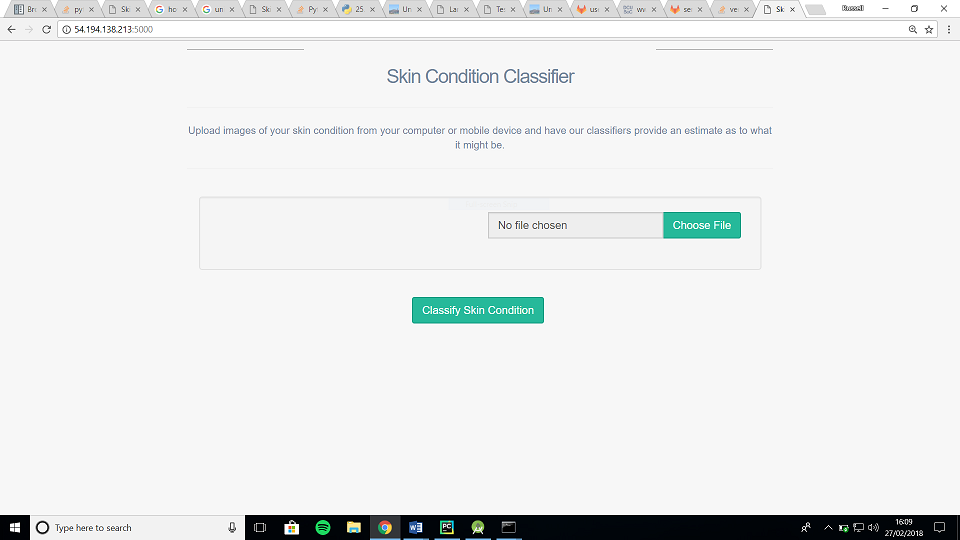   
Diagram 1 – Web App Homepage

When the user has chosen their photo it appears in the file upload box so the user knows they have selected the correct image. Should they decide they are not happy with their image they can choose to clear it or change it.

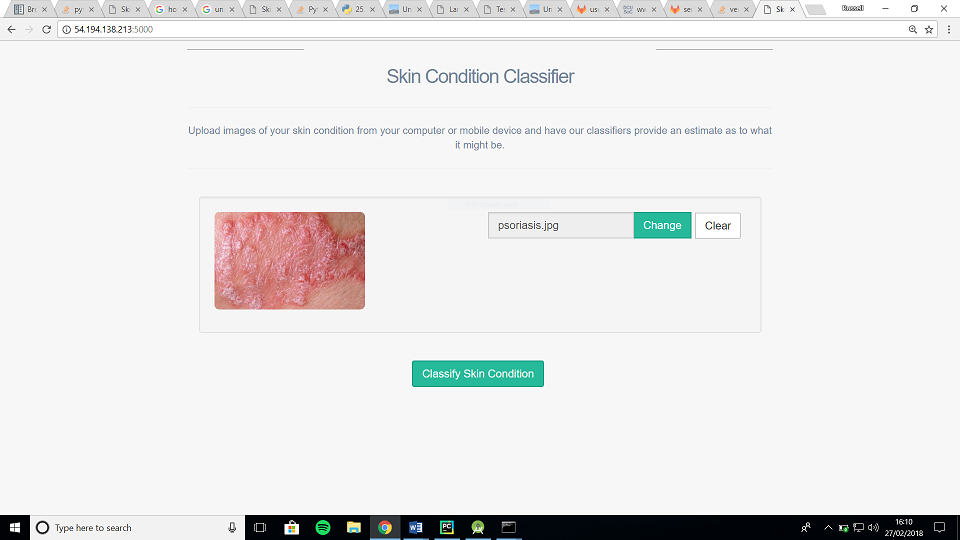   
Diagram 2 – Choose Image

Once the user is happy with the image they have chosen all the user has to do is click the 'Classify Skin Condition' and the page is refreshed with the results and a graphical barchart representation of the results. This can be seen below.

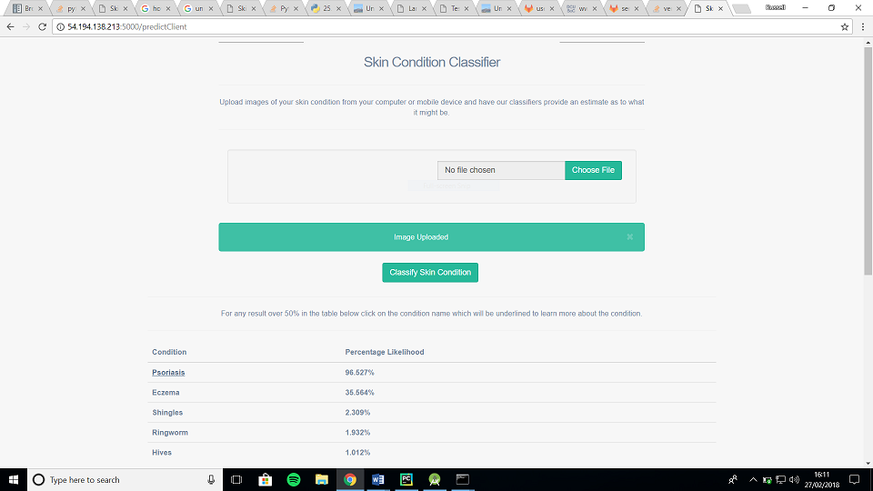   
Diagram 3 – Image Uploaded and Classified 

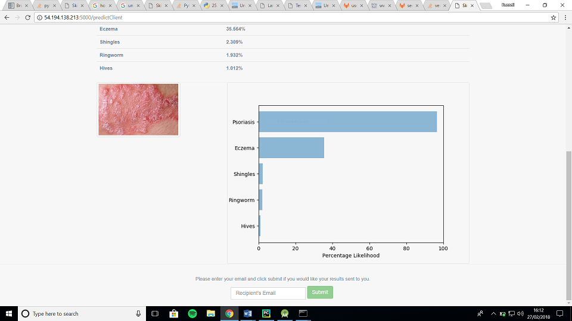   
Diagram 4 – Image Uploaded and Classified

**1.2 - Taking a photo for classification**  

A user can't take a photo on the normal desktop however the web app supports photo taking on mobile and tablet devices. On mobile and tablet devices when the user clicks the 'Choose File' button they have the choice to take a photo or upload a photo. Should they choose to take a photo then they are taken to the devices native camera to take the photo. When the photo has been taken then they are returned to the app where the image is displayed. An example of the web app working on a mobile device can be seen below.

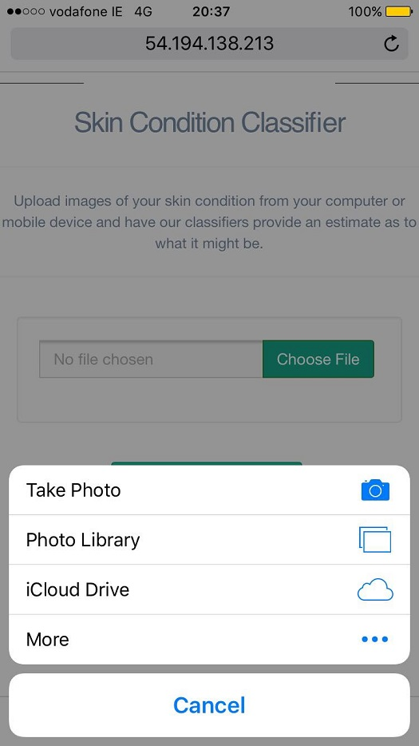   
Diagram 5 – Taking photo using Web App on mobile device

**1.3 - Sending an email with results of classification**    

When a user gets their image classified they can then choose to send the results to themselves or somebody else. They can do this by typing the email address into the submit box at the bottom of the page and pressing the submit button.

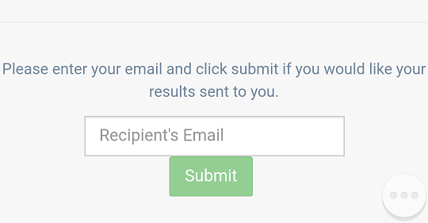   
Diagram 6 – Automatic email system

**1.4 - Accesing link to most likely skin conditions**   

When the results are returned, any condition which returns a result over 50% will be underlined and will provide a link to the HSE webpage on the condition to give the user more information. This can be seen below where Psoriasis is underlined as it is over 50% likelihood.

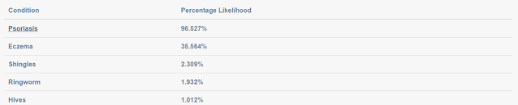   
Diagram 7 – Results

**2 - Android Application**
=======================

After initial download from the app store the app is ready for use once the user has internet access on the phone. When they first access the app a splash screen is displayed as can be seen below. The splash screen is displayed until the main page is fully loaded. At this point the main page is displayed. The main page has two main buttons allowing the user to either upload a picture for classification from their phone or take a photo in the app and have it classified.

 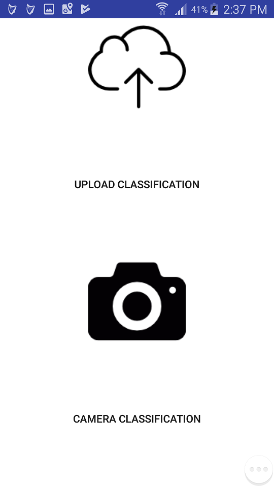   
Diagram 8 – Splash screen and homepage

**2.1 - Uploading an image for classification**

When you are in the main page and choose to upload an image you are brought to the following page. The user can then choose to 'Select Image'. When they do so they will be able to then choose an image from their phone. When this is done the image will be displayed for the user to see. They can then click the 'Upload Image' button and classification will be performed on the image. The results will be returned on the same page for the user to see.

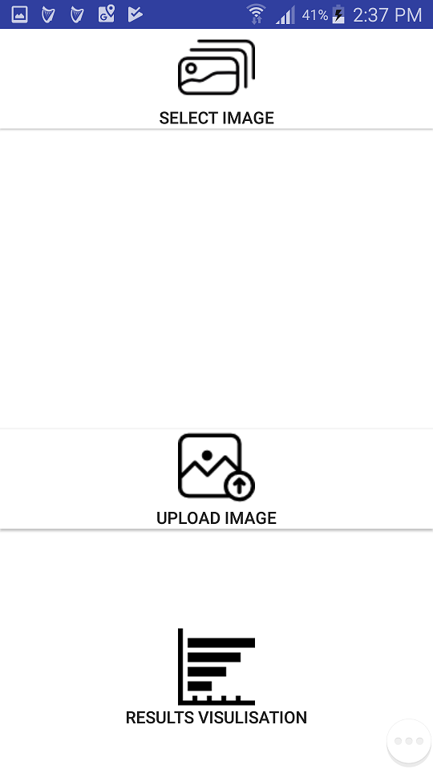 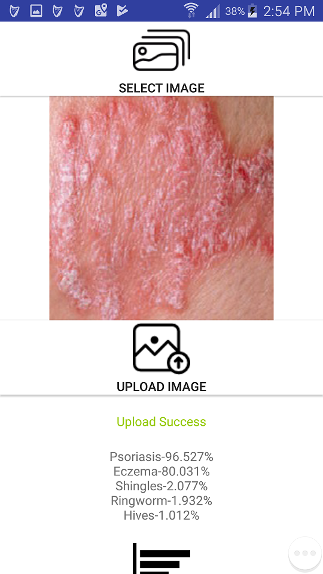   
Diagram 9 – Image Upload Page

**2.2 - Taking a photo for classification**

Should the user wish to take a photo of a skin condition using the app they can choose the 'Camera Classification' button which will take them into a screen where the user can take a photo using an in-built camera and have it uploaded all in one click by pressing the 'Classify Skin Condition' button. The results are returned on the same page. Here is a picture of this page once the user has taken a photo and the results have been returned.

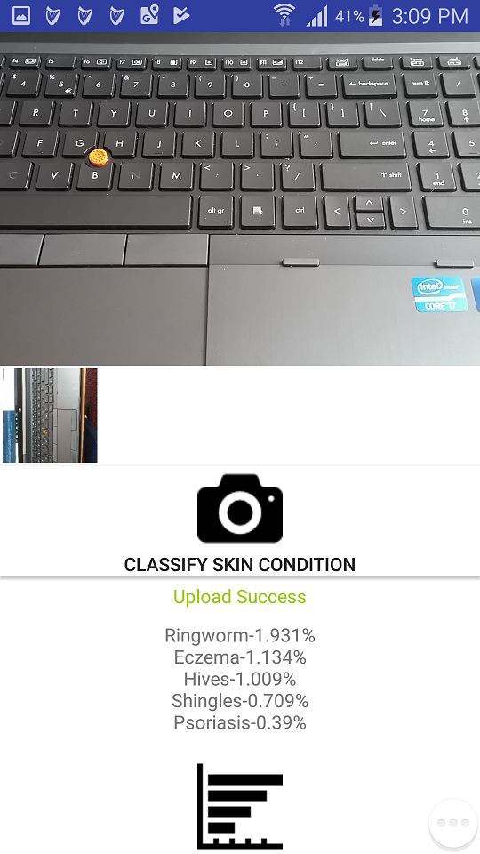   
Diagram 10 – Take Photo Page

**2.3 - View visual representation of results and send email including results**

When the user has had their image classified they can choose to view a visual representation of the results. On this page will be displayed a barchart of the results. Along with this the user has the option to send the results in an email to an email address they input as well as accessing the HSE webpage of any skin condition whos percentage likelihood is over 50%. Any condition which is underlined has a lonk to their respective HSE webpage.

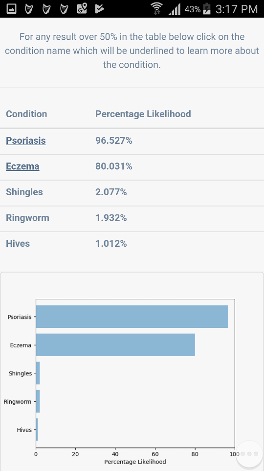
   
Diagram 11 – Visual Representation Page
